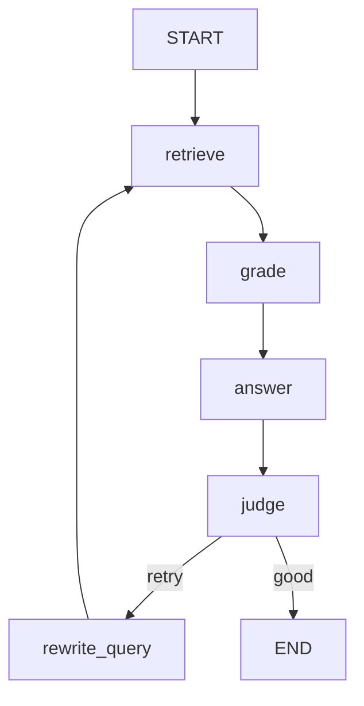
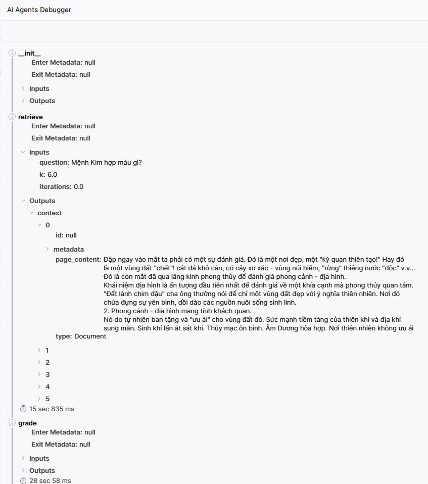
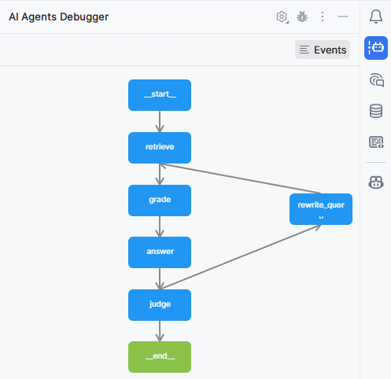
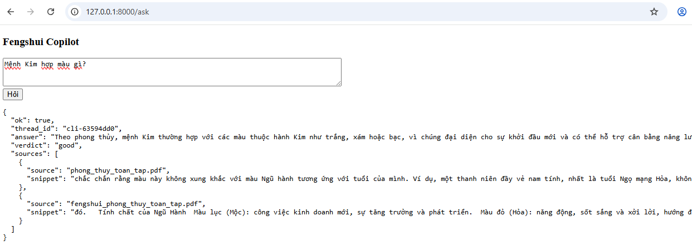
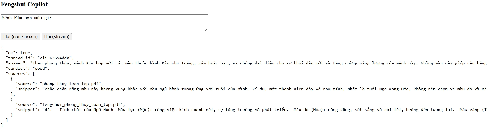
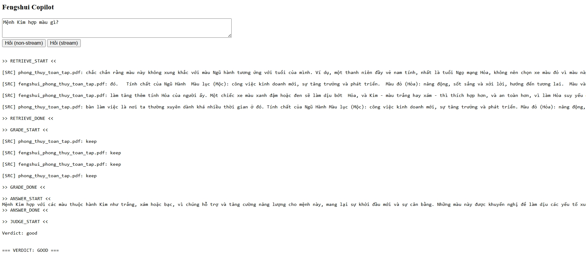

Project này được tạo ra chủ yếu để học về LangChain và LangGraph. 

**Features**
* Q&A phong thủy có trích dẫn nguồn (RAG)
* Tool: đổi lịch, gợi ý ngũ hành/màu...
* LangGraph: tự chấm điểm, re-retrieve khi cần.

Project này sẽ được thực hiện thông qua chuỗi bài học sau:
* Bài 1 — Chuẩn bị môi trường + Django skeleton + Hello LLM
* Bài 2 — LangChain căn bản (Prompt → Model → Output Parser)
* Bài 3 — RAG v1: ingest tài liệu phong thủy (local)
* Bài 4 — Đánh giá nhỏ
* Bài 5 — LangGraph: vòng lặp tự-chấm
* Bài 6 — Tool Use + Router
* Bài 7 — Django UI
* Bài 8 — Theo dõi & cấu hình
* Bài 9 — Đóng gói & bàn giao

_Chú ý:_ Cài đặt các package cần thiết được liệt kê trong requirements.txt

# Bài 1: Chuẩn bị môi trường + Django skeleton + Hello LLM
## Mục tiêu
* Tạo venv, cài base: Django, langchain, langgraph, chromadb, python-dotenv
* Tạo app copilot
* Tạo lệnh quản trị hello_llm gọi LLM (Ollama): in câu chào, log thời gian phản hồi.

## Các bước thực hiện
1. Cài Ollama, pull mô hình về (các bạn có thể lựa chọn mô hình khác):
```bash
ollama pull llama3.1:8b
```
2. Cài đặt package, tạo app copilot: python manage.py startapp copilot
3. Nạp .env trước khi Django chạy
```python
def main():
    """Run administrative tasks."""
    os.environ.setdefault("DJANGO_SETTINGS_MODULE", "fengshui.settings")
    load_dotenv() # nạp .env
    try:...
```

4. Tạo lệnh quản trị hello_llm trong copilot/management/commands/hello_llm.py
**Django management command là gì?**
* Là lệnh CLI tùy biến chạy qua `python manage.py <tên_lệnh>`
* Dùng khi bạn muốn viết script có ngữ cảnh Django đầy đủ (đã load settings, app, db...) - tiện cho việc gọi LLM,...
* <tên_lệnh> = tên file, Django sẽ tự dò các file trong your_app/management/commands/*.py. Bên trong đó có 1 lớp tên 
Command kế thừ BaseCommand, Django sẽ gọi lớp này khi chạy lệnh.
```python
class Command(BaseCommand):
    help = "Gọi LLM chào hỏi người dùng, cấu hình qua .env"

    def handle(self, *args, **kwargs):
        model = os.getenv("LLM_MODEL")
        llm = ChatOllama(model=model, temperature=0)

        prompt = "Bạn là trợ lý về phong thủy, hãy chào tôi bằng 1-2 câu tiếng Việt."

        t0 = time.time()
        res = llm.invoke(prompt)

        self.stdout.write(f"[{model}] {res.content} \nTook {time.time() - t0:.2f}s")
```
Chạy lệnh `python manage.py hello_llm`, ta sẽ thấy kết quả theo mẫu sau:
```
[llama3.1:8b] Chào bạn! Tôi rất vui được gặp và hỗ trợ bạn trong lĩnh vực phong thủy. Bạn cần tư vấn gì hôm nay? 
Took 19.87s
```

# Bài 2: LangChain căn bản (Prompt → Model → Output Parser)
## LangChain là gì?
* LangChain là bộ "lego" giúp bạn lắp ghép các bước làm việc với LLM: soạn prompt → gọi model → ép định dạng 
→ (tùy chọn) tìm tài liệu (RAG) → (tùy chọn) gọi tool → trả kết quả.
* Bạn lắp các bước trên bằng thứ gọi là "ống nối" LCEL (|). Ví dụ: `PromptTemplate | ChatModel | OutputParser`
* Một số mảnh "lego" phổ biến:
  * PromptTemplate: khuôn lời nhắc có biến ({question})
  * ChatModel: như chúng ta dùng là Ollama
  * OutputParser: ép định dạng trả về của model (JSON, text,...)
  * DocumentLoader + TextSplitter: đọc tài liệu và tách thành các đoạn nhỏ (cho RAG)
  * Embedding + VectorStore: chuyển đoạn văn thành vector rồi lưu để tìm theo ngữ nghĩa
  * Retriever: lấy top-k đoạn liên quan cho câu hỏi
  * Memory: lưu lịch sử hội thoại (tùy chọn)

  ...
* LangChain giúp chúng ta tập trung vào logic của AI mà không phải viết tay mọi kết nối (I/O, format,...) từ đầu.

**Mục tiêu bài 2**: tạo lệnh structured_qa - mẫu "Prompt → Model → Output Parser" (về sau có thể dùng để debug)
**Các bước thực hiện**
1. Tạo lệnh quản trị structured_qa trong copilot/management/commands/
2. Khai báo pydantic schema để ép định dạng trả về:
* Output Parser là lớp hậu xử lý trong LangChain. Dù đã nhắc LLM bằng format_instructions, parser vẫn cần để chuyển 
chuỗi đầu ra thành dữ liệu có cấu trúc (Pydantic model), kiểm tra & validate (kiểu, ràng buộc, thiếu trường), và ném 
lỗi sớm khi sai. Nhờ đó, pipeline ổn định và code phía sau dùng dữ liệu như object Python thay vì văn bản tự do.
```python
class FengshuiAnswer(BaseModel):
    # Dấu ... (gọi là ellipsis) ở đây là một giá trị đặc biệt từ module builtins của Python, đại diện cho việc
    # field này bắt buộc phải có giá trị (required) và không có giá trị mặc định (no default value).
    # Nếu muốn có default, bạn thay ... bằng giá trị cụ thể, ví dụ Field("Mặc định").
    answer: str = Field(..., description="Câu trả lời ngắn gọn bằng tiếng Viêt, ~80 từ")
    citations: List[str] = Field(
        default_factory=list,
        description="Các khái niệm/nguồn liên quan (ví dụ: ngũ hành, bát quái,...)"
    )
    confidence: float = Field(
        0.6, ge=0.0, le=1.0,
        description="Độ tin cậy từ 0.0 đến 1.0"
    )
```
3. Tạo prompt template:
* Tạo format instruction dựa trên parser trước đó (chú ý đây chỉ là lời nhắc cho model thôi, về sau parser trong chain
vẫn phải kiểm tra và ép về chính xác định dạng chúng ta yêu cầu):
```python
class Command(BaseCommand):
    help = "Hỏi đáp phong thủy (LangChain + Ollama) có ép JSON"

    def add_arguments(self, parser):
        parser.add_argument("--q", dest="question", required=False,
                            default="Mệnh Kim hợp màu gì?", help="Câu hỏi tiếng Việt")

    def handle(self, *args, **opts):
        model = os.getenv("LLM_MODEL")
        llm = ChatOllama(model=model, temperature=0)

        # Tạo parser + format instructions
        parser = PydanticOutputParser(pydantic_object=FengshuiAnswer)
        format_instructions = parser.get_format_instructions()
```
* Tạo prompt template:
```python
prompt = ChatPromptTemplate.from_messages([
    ("system",
     "Bạn là chuyên gia phong thủy, hãy trả lời ngắn gọn, không bịa"
     " CHỈ TRẢ VỀ DỮ LIỆU THEO SCHEMA JSON được cung cấp"),
    ("human",
     "Câu hỏi: {question}\n\n"
     "Hãy tuân thủ nghiêm ngặt hướng dẫn định dạng sau:\n {format_instructions}")
])
```
4. Tạo chain và chạy:
```python
# Tạo chain:
chain = prompt | llm | parser

t0 = time.time()
try:
    # Đây chính là tác dụng của parser
    res: FengshuiAnswer = chain.invoke({
        "question": opts["question"],
        "format_instructions": format_instructions
    })
# Vì thừa, không đúng định dạng nên không thể parse được
except Exception as e:
    self.stderr.write(self.style.WARNING(f"Parse lỗi, thử fallback: {e}"))
    raw = (prompt | llm).invoke({
        "question": opts["question"],
        "format_instructions": format_instructions
    }).content

    match = re.search(r"\{.*\}", raw, re.DOTALL) # Tìm đoạn JSON dài nhất trong raw nhằm cắt ra khỏi văn bản thừa
    if not match:
        raise CommandError("Không tìm thấy JSON trong câu trả lời")
    res = parser.parse(match.group(0))

dt = time.time() - t0

self.stdout.write(json.dumps(res.dict(), ensure_ascii=False, indent=2))
self.stdout.write(self.style.SUCCESS(f"[{model}] took {dt:.2f}s"))
```
Test thử với lệnh:
```bash
python manage.py structured_qa --q "Nhà hướng Đông Nam hợp mệnh nào?"
````
Ta sẽ nhận được kết quả tương tự như sau:
```json
{
  "answer": "Nhà hướng Đông Nam hợp với người mệnh Mộc và Thủy",
  "citations": [
    "Ngũ hành",
    "Bát quái"
  ],
  "confidence": 0.8
}
[llama3.1:8b] took 95.44s
```

**Tổng kết bài 2:**
* Chúng ta đã tạo được lệnh hỏi đáp phong thủy có ép định dạng trả
* Chúng ta đã làm quen với các mảnh "lego" cơ bản của LangChain: PromptTemplate, ChatModel, OutputParser
* Chúng ta đã thấy được sức mạnh của OutputParser trong việc kiểm soát định dạng trả về, giúp pipeline ổn định hơn.
Về sau, chúng ta sẽ tiếp tục xây dựng dựa trên pipeline này để thêm RAG, tool, memory,...

# Bài 3: RAG v1 (Ingest → Split → Embed → Retrieve)
## RAG là gì?
* RAG (Retrieval-Augmented Generation) là kỹ thuật kết hợp LLM với hệ thống tìm kiếm tài liệu để cải thiện độ chính xác và
tính cập nhật của câu trả lời, giúp câu trả lời bám vào dữ kiện tài liệu của chúng ta, giảm bịa đặt.
* Ý tưởng chính: trước khi trả lời câu hỏi, LLM sẽ tìm kiếm các tài liệu liên quan trong kho dữ liệu (vector store) và sử dụng
chúng làm nguồn tham khảo để tạo câu trả lời.
* Quy trình RAG gồm các bước:
  1. Ingest: thu thập và nạp tài liệu vào hệ thống.
  2. Split: tách tài liệu thành các đoạn nhỏ để dễ quản lý và tìm kiếm.
  3. Embed: chuyển các đoạn văn bản thành vector (embedding) để lưu trữ và tìm kiếm theo ngữ nghĩa.
  4. Store: lưu trữ các vector trong cơ sở dữ liệu vector (vector store, ở đây chúng ta dùng Chroma).
  5. Retrieve: tìm kiếm và lấy các đoạn văn bản liên quan từ vector store dựa trên câu hỏi của người dùng.
  6. Generate: Kết hợp thông tin truy xuất được vào prompt gửi đến LLM (tăng cường). LLM tạo ra câu trả lời dựa trên dữ 
  liệu tăng cường, đảm bảo tính cập nhật và chính xác.

## Các bước thực hiện
1. Cài đặt các package cần thiết: langchain-chroma, chromadb, langchain-textsplitters

    Pull embedding model cho Ollama: `ollama pull bge-m3` hoặc nomic-embed-text
2. Chuẩn bị tài liệu phong thủy:
* Tạo thư mục fengshui-copilot/data/corpus chưa các file tài liệu về phong thủy (md, txt, pdf,...)
* Tôi có cho sẵn một số tài liệu, bạn đọc có thể bổ sung thêm.

3. Tạo file cài đặt các tham số hệ thống:
* Tạo file copilot/rag/settings.py:
```python
ROOT_DIR = Path(__file__).resolve().parents[2]
DATA_DIR = ROOT_DIR / "data"

CORPUS_DIR = Path(os.getenv("RAG_CORPUS_DIR", DATA_DIR / "corpus"))
CHROMA_DIR = Path(os.getenv("RAG_CHROMA_DIR", DATA_DIR / "chroma"))
COLLECTION_NAME = os.getenv("RAG_COLLECTION_NAME", "fengshui")

# Tham số split & retrieve
CHUNK_SIZE = int(os.getenv("RAG_CHUNK_SIZE", 800))
CHUNK_OVERLAP = int(os.getenv("RAG_CHUNK_OVERLAP", 120))
TOP_K = int(os.getenv("RAG_TOP_K", 4))

# Model
EMBEDDING_MODEL = os.getenv("RAG_EMBEDDING_MODEL") # Tôi dùng bge-m3
LLM_MODEL = os.getenv("LLM_MODEL")

# Đảm bảo thư mục tồn tại
def ensure_dirs():
    CORPUS_DIR.mkdir(parents=True, exist_ok=True)
    CHROMA_DIR.mkdir(parents=True, exist_ok=True)
```
* CHUNK_SIZE: kích thước tối đa của mỗi chunk (đoạn văn bản nhỏ) sau khi split
* CHUNK_OVERLAP: độ chồng lắp giữa các chunk (giúp giữ ngữ cảnh) - tức là mỗi cặp chunk liền kề sẽ có một phần nội dung trùng nhau.
* TOP_K: số đoạn văn bản liên quan sẽ lấy ra để tăng cường cho LLM

4. Tạo file nạp (ingest) tài liệu:
* Tạo file copilot/rag/ingest.py
* Trước tiên, chúng ta viết 2 hàm load file:
```python
def _load_text_file(path: Path) -> str:
    with open(path, "r", encoding="utf-8", errors="ignore") as f:
        return f.read()

def _load_pdf_file(path:Path) -> str:
    text = []
    try:
        reader = PdfReader(str(path))
        for page in reader.pages:
            text.append(page.extract_text() or "")
    except Exception:
        return ""

    return "\n".join(text)
```
* Viết hàm load_corpus để duyệt thư mục, đọc các file có đuôi phù hợp rồi trả về danh sách LangChain Document:
```python
def load_corpus(corpus_dir: Path) -> List[Document]:
    EXTS = (".txt", ".md", ".markdown", ".mdx", ".pdf")
    docs = []

    for p in corpus_dir.rglob("*"):
        if p.is_file() and p.suffix.lower() in EXTS and not p.name.startswith("."):
            try:
                if p.suffix.lower() == ".pdf":
                    content = _load_pdf_file(p)
                else:
                    content = _load_text_file(p)
            except Exception as e:
                print(f"[INGEST] Skip {p} ({e})")
                continue

            content = (content or "").strip() # phải (content or "") vì hàm _load_text_file có thể trả về None
            if not content:
                continue
            docs.append(Document(
                page_content=content,
                metadata={"source": str(p.relative_to(corpus_dir))} # đường dẫn tương đối đối với corpus_dir
                # thêm metadata để sau này hiện trích dẫn trong câu trả lời
            ))

    return docs
```
* Viết hàm chunk_documents để tách các Document lớn thành các đoạn nhỏ hơn có start_index (vị trí bắt đầu trong văn bản gốc) để _make_id sau này tạo id ổn định:
```python
def chunk_documents(docs: List[Document]) -> List[Document]:
    splitter = RecursiveCharacterTextSplitter(
        chunk_size=CHUNK_SIZE, chunk_overlap=CHUNK_OVERLAP,
        add_start_index=True
    )
    return splitter.split_documents(docs)

def _make_id(doc: Document) -> str:
    src = doc.metadata.get("source", "")
    start = doc.metadata.get("start_index", None)
    return f"{src}::{start}"
```
* Viết hàm build_or_update_chroma để tạo hoặc cập nhật Chroma vector store:
```python
def build_or_update_chroma(chunks: List[Document], reset: bool = False) -> int:
    ensure_dirs()

    if reset and CHROMA_DIR.exists():
        shutil.rmtree(CHROMA_DIR)

    embeddings = OllamaEmbeddings(model=EMBEDDING_MODEL)

    # Chroma vector store
    vs = Chroma(
        collection_name=COLLECTION_NAME,
        embedding_function=embeddings,
        persist_directory=str(CHROMA_DIR)
    )

    # Tạo id ổn định để tránh trùng lặp nếu ingest nhiều lần
    seen = set()
    docs_unique, ids_unique = [], []
    for doc in chunks:
        _id = _make_id(doc)
        if _id in seen:
            continue
        seen.add(_id)
        docs_unique.append(doc)
        ids_unique.append(_id)

    vs.add_documents(docs_unique, ids=ids_unique)

    return len(ids_unique)
```
* Viết hàm ingest_corpus tổng hợp các bước trên:
```python
def ingest_corpus(reset: bool = False) -> dict:
    ensure_dirs()
    docs = load_corpus(CORPUS_DIR)
    chunks = chunk_documents(docs) if docs else []
    n = build_or_update_chroma(chunks, reset=reset) if chunks else 0
    return {
        "files": len(docs),
        "chunks": len(chunks),
        "added": n,
        "corpus_dir": str(CORPUS_DIR),
        "chroma_dir": str(CHROMA_DIR),
        "collection": COLLECTION_NAME,
    }
```
5. Tạo file truy xuất (retrieve) tài liệu:
* Tạo file copilot/rag/retriever.py
```python
def get_retriever(top_k: int | None = None):
    embeddings = OllamaEmbeddings(model=EMBEDDING_MODEL)

    vs = Chroma(
        collection_name=COLLECTION_NAME,
        embedding_function=embeddings,
        persist_directory=str(CHROMA_DIR)
    )
    return vs.as_retriever(search_kwargs={"k": top_k or TOP_K})
```
6. Tạo 2 lệnh quản trị để ingest và hỏi thử RAG:
* Tạo lệnh ingest_corpus trong copilot/management/commands/ingest_corpus.py
```python
def Command(BaseCommand):
    help = "Ingest tài liệu phong thuỷ vào Chroma (embed->split)"

    def add_arguments(self, parser):
        parser.add_argument(
            "--reset", action="store_true",
            help="Xóa index cũ trước khi ingest"
        )

    def handle(self, *args, **opts):
        t0 = time.time()
        stats = ingest_corpus(reset=opts["reset"])
        dt = time.time() - t0

        self.stdout.write(self.style.SUCCESS(
            f"INGEST DONE in {dt:.2f}s | files={stats['files']} "
            f"chunks={stats['chunks']} added={stats['added']}\n"
            f"corpus={stats['corpus_dir']} | chroma={stats['chroma_dir']} "
            f"| collection={stats['collection']}"
        ))
```
* Tạo lệnh rag_ask trong copilot/management/commands/rag_ask.py
```python
ANSWER_PROMPT = ChatPromptTemplate.from_messages([
    ("system",
     "Bạn là trợ lý phong thuỷ. Trả lời ngắn gọn, dựa trên ngữ cảnh được cung cấp."
     " Nếu ngữ cảnh không đủ, hãy nói 'Tôi không chắc từ tài liệu hiện có.'"),
    ("human",
     "Câu hỏi: {question}\n\n"
     "Ngữ cảnh (có thể rút gọn):\n{context}\n\n"
     "Yêu cầu:\n- Trả lời 2–4 câu tiếng Việt, bám sát ngữ cảnh.\n"
     "- Liệt kê nguồn (tên file) đã dùng ở cuối câu trả lời.")
])

class Command(BaseCommand):
    help = "Hỏi–đáp với RAG (retriever + LLM), in câu trả lời kèm nguồn."

    def add_arguments(self, parser):
        parser.add_argument("--q", dest="question", required=True,
                            help="Câu hỏi phong thủy (tiếng Việt)")
        parser.add_argument("--k", dest="top_k", type=int, default=TOP_K,
                            help="Số đoạn trích dẫn lấy về (top k)")
        parser.add_argument("--model", default=LLM_MODEL,
                            help="Tên model Ollama")
        parser.add_argument("--temp", type=float, default=0.0)

    def handle(self, *args, **opts):
        q = opts["question"]
        k = opts["top_k"]
        model = opts["model"]
        temp = opts["temp"]

        # Lấy ngữ cảnh
        retriever = get_retriever(k)
        docs = retriever.invoke(q)

        # Ghép đoạn trích tài liệu + nguồn để tạo ngữ cảnh
        ctx_lines = []
        used_files = set()

        for i, d in enumerate(docs):
            snippet = d.page_content.strip().replace("\n", " ")

            # if len(snippet) > 500:
            #     snippet = snippet[:500] + "..."

            src = d.metadata.get("source", "")
            used_files.add(src)

            ctx_lines.append(f"[{i+1}] {snippet} (SOURCE: {src})")

        context = "\n\n".join(ctx_lines) if ctx_lines else "(Không có ngữ cảnh)"

        llm = ChatOllama(model=model, temperature=temp)
        chain = ANSWER_PROMPT | llm

        t0 = time.time()
        res = chain.invoke({
            "question": q,
            "context": context
        })
        dt = time.time() - t0

        answer = res.content.strip()
        sources = ", ".join(sorted(used_files)) if used_files else "Không có"
        self.stdout.write(f"[{model}] {answer}\n\n"
                          f"Sources: {sources}\n"
                          f"Took {dt:.2f}s")
```
* Test thử:
* Chạy lệnh ingest_corpus: `python manage.py ingest_corpus` hoặc `python manage.py ingest_corpus --reset` để xóa index cũ.
* Chạy lệnh rag_ask:

Mọi người có thể xóa index trong \chroma xem trước kết quả như nào, sau đó hẵng ingest lại dữ liệu để thấy hiệu quả.
```bash
python manage.py rag_ask --q "Mệnh Kim hợp màu gì?"
python manage.py rag_ask --q "Nhà hướng Đông Nam hợp mệnh nào?" --k 6
```
Output:
```
[llama3.1:8b] Mệnh Kim hợp với màu sáng và nhẹ nhàng như màu trắng, vàng, ánh kim. Những màu này giúp cân bằng và hỗ trợ cho người mệnh Kim.

Nguồn:
1. phong_thuy_toan_tap.pdf
2. phong_thuy_thuc_hanh_trong_xay_dung_va_kien_truc_nha_o.pdf

Sources: phong_thuy_thuc_hanh_trong_xay_dung_va_kien_truc_nha_o.pdf, phong_thuy_toan_tap.pdf
Took 260.47s
```
```
[llama3.1:8b] Nhà hướng Đông Nam hợp với người mệnh Mộc và Thủy.

Nguồn: phong_thuy_toan_tap.pdf, phong_thuy_thuc_hanh_trong_xay_dung_va_kien_truc_nha_o.pdf

Sources: phong_thuy_thuc_hanh_trong_xay_dung_va_kien_truc_nha_o.pdf, phong_thuy_toan_tap.pdf
Took 299.03s
```

# Bài 4: Đánh giá RAG
* Mục tiêu: có các con số để chứng minh hệ RAG hoạt động.
* Evaluation set: 1 file jsonl, mỗi dòng gồm:
  * q: câu hỏi
  * sources: danh sách tên file trong corpus được coi là nguồn đúng (file-level)
  * ref: câu trả lời tham chiếu ngắn
* Trong bài này, chúng ta sẽ triển khai 3 cách đánh giá (2 đánh giá chất lượng truy vấn tài liệu, 1 đánh giá chất lượng 
câu trả lời):
  * Recall@k (file-level): % câu hỏi mà trong số tok-k chunk lấy về có ít nhất 1 chunk từ nguồn đúng.
  * MRR@k (Mean Reciprocal Rank (xếp hạng nghịch đảo trung bình)): trung bình của 1/rank với rank là vị trí chunk khớp 
  đúng đầu tiên với sources trong top-k (không khớp → 0).
  * Answer quality: chấm thô bằng "lexical" F1 (F1 score bản từ ngữ, so trùng từ giữa answer và ref). Có thể kèm model 
  cho điểm 0..1 dựa vào đúng/sai của nội dung.

_Lưu ý:_ Ở đây chúng ta chỉ mới triển khai ngang file-level, về sau có thể nâng cấp lên chunk-level (tính
trùng từ trong chunk lấy về với chunk đúng).

## Các bước thực hiện
### 1. Chuẩn bị dữ liệu đánh giá
* Lần này tôi có bổ sung thêm 4 file tài liệu nữa vào mục data (ban đầu 2). Ở bước này, chúng ta có thể nhờ các AI agent 
tạo giúp chúng ta file dữ liệu đánh giá qa.jsonl, mọi người có thể tham khảo prompt đơn giản sau:
```
Hiện tại tôi đang muốn tạo một tập dữ liệu đánh giá cho mô hình RAG trong project của tôi với tập eval set là 1 file .jsonl mỗi dòng gồm: 
- q: câu hỏi 
- sources: danh sách tên file trong corpus được coi là nguồn đúng (file-level) 
- ref (tùy chọn): câu trả lời tham chiếu ngắn 

Mẫu: 
{"q": "Mệnh Kim hợp màu gì?", "sources": ["ngu_hanh_co_ban.md"], "ref": "Mệnh Kim hợp trắng, xám, ánh kim; tương sinh Thổ như vàng, nâu."} 
{"q": "Nhà hướng Đông Nam hợp mệnh nào?", "sources": ["huong_nha_tom_tat.txt"], "ref": "Đông Nam thuộc Mộc, thường hợp mệnh Mộc và mệnh Hoả (tương sinh)."} 
{"q": "Ngũ hành gồm những yếu tố nào?", "sources": ["ngu_hanh_co_ban.md"], "ref": "Kim, Mộc, Thuỷ, Hoả, Thổ."} 

Về phần source, tôi có gửi cho bạn các nguồn như trên, bạn hãy load và đọc kĩ các file rồi tạo giúp tôi file jsonl phía trên. 
Tài liệu tìm được khá hạn chế, nếu có thể bạn hãy tự tìm kiếm, tải về, phân tích tài liệu rồi viết thêm vào file jsonl giúp tôi. 

Chú ý phải làm cho thật chính xác, phải có ít nhất 100 câu, để tôi có thể đánh giá kết quả mô hình của bản thân một cách có hiệu quả.
```
### 2. Tạo 2 lệnh đánh giá chất lượng retrieval tài liệu: Recall@k và MRR@k
* Tạo file copilot/rag/eval_retrieval.py
* Tạo hàm đọc file jsonl:
```python
def read_jsonl(path: Path):
    if not path.exists():
        raise FileNotFoundError(path)
    with open(path, 'r', encoding='utf') as f:
        for line in f:
            line = line.strip()
            if line:
                yield json.loads(line)
```
* Tạo lệnh:
```python
class Command(BaseCommand):
    help = "Đánh giá retrieval ở file-level với 2 phương pháp: Recall@k và MRR@k"

    def add_arguments(self, parser):
        parser.add_argument("--file", default=str(DATA_DIR / "eval" / "qa.jsonl"))
        parser.add_argument("--k", type=int, default=TOP_K)

    def handle(self, *args, **opts):
        eval_path = Path(opts["file"])
        k = opts["k"]

        data = list(read_jsonl(eval_path))
        if not data:
            raise CommandError(f"Eval set rỗng: {eval_path}")

        retriever = get_retriever(k)

        recalls, mrrs = [], []
        t0 = time.time()

        for i, item in enumerate(data):
            q = item["q"]
            gold = item.get("sources", "")
            docs = retriever.invoke(q)

            ranked_src = [d.metadata.get("source", "") for d in docs]
            hit = any(r in gold for r in ranked_src)
            recalls.append(hit)

            rr = 0.0
            for rank, src in enumerate(ranked_src):
                if src in gold:
                    rr = 1.0 / (rank + 1)
                    break
            mrrs.append(rr)

            self.stdout.write(
                f"[i] Q: {q}\n"
                f"gold: {gold}\n"
                f"got: {ranked_src}\n"
                f"Hit: {hit}, Reciprocal Rank (rr): {rr:.3f}\n"
            )

        dt = time.time() - t0
        self.stdout.write(self.style.SUCCESS(
              f"\nDone in {dt:.2f}s | k={k}\n"
              f"Recall@{k}: {mean(recalls):.3f} | MRR@{k}: {mean(mrrs):.3f} "
              f"{len(data)} câu."
        ))
```
* Test thử:
```bash
python manage.py eval_retrieval
```
Output:
```
...
[101] Q: Cửa phụ có cần lựa chọn theo tuổi gia chủ không?
gold: ['phong_thuy_thuc_hanh_trong_xay_dung_va_kien_truc_nha_o.pdf']
got: ['tu-vi-dau-so-toan-thu-tran-doan.pdf', 'TU_VI_THUC_HANH.pdf', 'phong_thuy_toan_tap.pdf', 'fengshui_phong_thuy_toan_tap.pdf']
Hit: False, Reciprocal Rank (rr): 0.000

Done in 4.93s | k=4
Recall@4: 0.337 | MRR@4: 0.097 101 câu.
```
### 3. Tạo lệnh đánh giá chất lượng câu trả lời dựa trên Lexical F1 (tùy chọn + LLM judge mini)
* Tạo file copilot/rag/eval_answer.py
* Viết hàm tokenize đơn giản chuyển câu thành tập các từ:
```python
def tokenize(s: str) -> list[str]:
    return re.findall(r"[0-9A-Za-zÀ-ỹ]+", (s or "").strip())
```
* Viết hàm tính F1 score:
```python
def f1_score(pred: str, ref: str) -> float:
    p = tokenize(pred)
    r = tokenize(ref)
    if not p or not r:
        return 0.0

    p_set = set(p)
    r_set = set(r)
    overlap = len(p_set & r_set)

    if overlap == 0:
        return 0.0

    precision = overlap / len(p_set)
    recall = overlap / len(r_set)
    return 2 * (precision * recall) / (precision + recall)
```
* Tạo prompt cho LLM đánh giá (chú ý phải "{{" chứ không phải "{")
```
JUDGE_PROMPT = ChatPromptTemplate.from_messages([
    ("system",
     "Bạn là chuyên gia, giám khảo về huyền học. Cho điểm 0..1 về ĐỘ CHÍNH XÁC so với câu tham chiếu. "
     "Chỉ chấm độ đúng (không chấm văn phong). Trả về đúng JSON: "
     '{{"score": <float>, "rationale": "<ngắn gọn>"}}'),
    ("human",
     "Câu hỏi: {question}\nTham chiếu: {ref}\nTrả lời: {pred}\n"
     "Chấm điểm và giải thích ngắn.")
])
```
* Tạo lệnh:
```python
class Command(BaseCommand):
    help = "Đánh giá chất lượng câu trả lời: F1 lexical + (tuỳ chọn) LLM judge mini."

    def add_arguments(self, parser):
        parser.add_argument("--file", default=str(DATA_DIR / "eval" / "qa.jsonl"))
        parser.add_argument("--k", type=int, default=TOP_K)
        parser.add_argument("--model", default=LLM_MODEL)
        parser.add_argument("--judge", action="store_true",
                            help="Bật chấm điểm bằng LLM")

    def handle(self, *args, **opts):
        eval_path = Path(opts["file"])
        k = opts["k"]
        model = opts["model"]
        use_judge = opts["judge"]

        data = list(read_jsonl(eval_path))
        if not data:
            raise CommandError(f"Eval set rỗng: {eval_path}")

        retriever = get_retriever(k)
        llm = ChatOllama(model=model)

        f1s, judge_scores = [], []
        t0 = time.time()

        for i, item in enumerate(data):
            q = item["q"]
            ref = item.get("ref", "").strip()

            docs = retriever.invoke(q)

            ctx_lines = []

            for j, d in enumerate(docs):
                snippet = d.page_content.strip().replace("\n", " ")

                # if len(snippet) > 500:
                #     snippet = snippet[:500] + "..."
                src = d.metadata.get("source", "")
                ctx_lines.append(f"[{j + 1}] {snippet} (SOURCE: {src})")

            context = "\n\n".join(ctx_lines) if ctx_lines else "(Không có ngữ cảnh)"

            pred = (ANSWER_PROMPT | llm).invoke({
                "question": q,
                "context": context
            }).content.strip()

            f1 = f1_score(pred, ref)
            f1s.append(f1)
            line = f"[{i+1}] Q: {q}\n REF: {ref}\n PRED: {pred}\n F1: {f1:.3f}"

            if use_judge:
                judge = (JUDGE_PROMPT | llm).invoke({
                    "question": q,
                    "ref": ref,
                    "pred": pred
                }).content.strip()

                m = re.search(r"\{.*\}", judge, re.DOTALL)
                if m:
                    try:
                        score = float(json.loads(m.group(0))["score"])
                    except Exception:
                        score = 0.0

                judge_scores.append(score)
                line += f" | Judge: {score:.3f} ({judge})"

            self.stdout.write(line + "\n")

        dt = time.time() - t0
        summary = f"\nDone in {dt:.2f}s | k={k}\n Avg F1: {mean(f1s):.3f}"
        if use_judge and judge_scores:
            summary += f" | Avg Judge: {mean(judge_scores):.3f}"
        self.stdout.write(self.style.SUCCESS(summary))
```
* Test thử:

Phần này nếu máy ai không đủ tài nguyên có thể xóa bớt nội dung trong file qa.jsonl để giảm số câu hỏi.
  * 
    ```bash
    python manage.py eval_answer
    ```
    Output:
    ```
    [1] Q: Quy luật Tương Sinh trong Ngũ Hành diễn ra theo thứ tự nào?
     REF: Thủy sinh Mộc; Mộc sinh Hỏa; Hỏa sinh Thổ; Thổ sinh Kim; Kim sinh Thủy.
     PRED: Quy luật Tương Sinh trong Ngũ Hành diễn ra theo thứ tự: Thủy sinh Mộc, Hỏa sinh Thổ, Thổ sinh Kim, Kim sinh Thủy.
    
    Nguồn:
    - phong_thuy_toan_tap.pdf
    - TU_VI_THUC_HANH.pdf
    - tu-vi-dau-so-toan-thu-tran-doan.pdf
     F1: 0.293
    [2] Q: Ngũ hành tương khắc theo thứ tự nào?
     REF: Thủy khắc Hỏa; Hỏa khắc Kim; Kim khắc Mộc; Mộc khắc Thổ; Thổ khắc Thủy.
     PRED: Ngũ hành tương khắc theo thứ tự: Kim khắc Hỏa, Thủy khắc Hỏa, Mộc khắc Thổ, Thổ khắc Thủy, Hỏa khắc Kim, Mộc khắc Kim.
    
    Nguồn:
    - TU_VI_THUC_HANH.pdf
    - tu-vi-dau-so-toan-thu-tran-doan.pdf
    - fengshui_phong_thuy_toan_tap.pdf
    - phong_thuy_thuc_hanh_trong_xay_dung_va_kien_truc_nha_o.pdf
     F1: 0.261
    ...
    ```
  *
    ```bash
    python manage.py eval_answer --judge
    ```
    Output:
    ```
    [1] Q: Quy luật Tương Sinh trong Ngũ Hành diễn ra theo thứ tự nào?
     REF: Thủy sinh Mộc; Mộc sinh Hỏa; Hỏa sinh Thổ; Thổ sinh Kim; Kim sinh Thủy.
     PRED: Quy luật Tương Sinh trong Ngũ Hành diễn ra theo thứ tự: Kim sinh Thủy, Thủy sinh Mộc, Mộc sinh Hỏa, Hỏa sinh Thổ, Thổ sinh Kim.
    
    Nguồn: phong_thuy_toan_tap.pdf, TU_VI_THUC_HANH.pdf, tu-vi-dau-so-toan-thu-tran-doan.pdf
     F1: 0.293 | Judge: 0.400 ({"score": 0.4, "rationale": "Danh sách thứ tự trong quy luật Tương Sinh được đưa ra là chính xác nhưng không theo trình tự vòng tròn Ngũ Hành (Kim, Thủy, Mộc, Hỏa, Thổ). Trình tự vòng tròn Ngũ Hành thường được sử dụng để miêu tả các mối quan hệ và quy luật của Ngũ Hành, vì vậy một danh sách thứ tự theo đúng vòng tròn có thể giúp người đọc dễ dàng nhận biết hơn về sự liên kết giữa các yếu tố trong Ngũ Hành."})
    
    Done in 77.75s | k=4
     Avg F1: 0.293 | Avg Judge: 0.400
    ```
* Chúng ta có thể dựa vào các con số này để đánh giá và cải thiện hệ thống RAG của mình, ví dụ:
  * Nếu Recall@k thấp, có thể do tài liệu không đủ hoặc quá trình embedding/retrieval chưa tốt.
  * Nếu F1 thấp, có thể do prompt chưa tốt hoặc LLM chưa hiểu đúng ngữ cảnh.
  * Dựa vào các câu hỏi cụ thể mà hệ thống trả lời sai để điều chỉnh prompt, thêm tài liệu, hoặc tinh chỉnh tham số:
    * Tăng k
    * Thay đổi chunk size/overlap
    * Thay embedding model

## LLM Provider linh hoạt
* Vấn đề: nhiều nơi gọi LLM (structured_qa, rag_ask, eval_answer, qa_graph). Nếu đổi provider (Ollama ↔ OpenRouter), sửa tay từng file sẽ dễ lỗi.
* Giải pháp: tạo một factory nhỏ get_chat(...) trả về model đã cấu hình sẵn dựa trên .env. Mọi lệnh chỉ from ... import get_chat và dùng.
* Lợi ích: DRY, đổi provider bằng sửa .env, không chạm code nghiệp vụ (RAG/graph giữ nguyên).
* Phạm vi: chỉ Chat model cho sinh câu trả lời/chấm điểm. Embeddings & Chroma vẫn dùng Ollama như Bài 3 (không đổi).
* Bạn có thể xem thống kê sử dụng trong trang activity của OpenRouter (nếu dùng OpenRouter làm provider).

Thực hành — Bật switch Ollama/OpenRouter
1) Cài gói (nếu chưa)
pip install -U langchain-openai openai langchain-ollama

2) Cập nhật .env
* Chú ý: sonoma-sky-alpha (OpenRouter) tôi dùng lúc này chỉ miễn phí trong thời gian nhất định, các bạn có thể tự tìm 
kiếm model khác phù hợp.
```
# Chọn 1:
LLM_PROVIDER=ollama
LLM_MODEL=llama3.1:8b

# Hoặc:
LLM_PROVIDER=openrouter
LLM_MODEL=openrouter/sonoma-sky-alpha
OPENROUTER_API_KEY=or-xxxxxxxxxxxxxxxx
OPENROUTER_BASE_URL=https://openrouter.ai/api/v1
OPENROUTER_HTTP_REFERER=http://localhost:8000
OPENROUTER_APP_TITLE=fengshui-copilot-dev
```
3) Tạo factory: copilot/llm/provider.py
* Thêm vào llm/__init__.py
```python
def env(name: str, default: Optional[str] = None) -> Optional[str]:
    v = os.getenv(name, default)
    return v.strip() if isinstance(v, str) else v
```

Chỉ thêm 1 file nhỏ để tránh lặp code; không đụng gì tới RAG.
```python
# copilot/llm/provider.py
class ProviderError(RuntimeError): ...

def get_chat(temperature: float = 0.0):
    """
    Trả về Chat model đã cấu hình theo .env:
      - LLM_PROVIDER=ollama -> ChatOllama(model)
      - LLM_PROVIDER=openrouter -> ChatOpenAI(base_url=OpenRouter)
      - (tuỳ chọn) LLM_PROVIDER=openai -> ChatOpenAI (OpenAI gốc)
    """
    provider = (env("LLM_PROVIDER", "ollama") or "ollama")
    model = model or env("LLM_MODEL", "llama3.1:8b")

    if provider == "ollama":
        return ChatOllama(model=model, temperature=temperature)

    if provider == "openrouter":
        api_key = env("OPENROUTER_API_KEY")
        if not api_key:
            raise ProviderError("Thiếu OPENROUTER_API_KEY trong .env")
        base_url = env("OPENROUTER_BASE_URL", "https://openrouter.ai/api/v1")
        headers = {
            "HTTP-Referer": env("OPENROUTER_HTTP_REFERER", "http://localhost"),
            "X-Title": env("OPENROUTER_APP_TITLE", "fengshui-copilot-dev"),
        }
        return ChatOpenAI(
            model=model,
            temperature=temperature,
            api_key=api_key,
            base_url=base_url,
            default_headers=headers,
        )

    if provider == "openai":
        api_key = env("OPENAI_API_KEY")
        if not api_key:
            raise ProviderError("Thiếu OPENAI_API_KEY trong .env")
        return ChatOpenAI(model=model, temperature=temperature, api_key=api_key)

    raise ProviderError(f"LLM_PROVIDER không hỗ trợ: {provider}")
```
4) Sửa 4 lệnh để dùng factory (patch mẫu)
```
copilot/management/commands/structured_qa.py
- from langchain_ollama import ChatOllama
+ from ...llm.provider import get_chat
...
- llm = ChatOllama(model=model, temperature=temp)
+ llm = get_chat(temperature=temp)

copilot/management/commands/rag_ask.py
- from langchain_ollama import ChatOllama
+ from ...llm.provider import get_chat
...
- llm = ChatOllama(model=model, temperature=temp)
+ llm = get_chat(temperature=temp)

copilot/management/commands/eval_answer.py
- from langchain_ollama import ChatOllama
+ from ...llm.provider import get_chat
...
- llm = ChatOllama(model=model, temperature=0)
+ llm = get_chat(temperature=0)
...
- judge_raw = (JUDGE_PROMPT | llm).invoke(...)
+ judge_raw = (JUDGE_PROMPT | get_chat(temperature=0)).invoke(...)
```

Lưu ý: không đụng Bài 3 (ingest/retriever) — embeddings vẫn là OllamaEmbeddings(nomic-embed-text).

5) Kiểm thử nhanh (switch bằng .env, không sửa code)
```bash
python manage.py rag_ask --q "Nhà hướng Đông Nam hợp mệnh nào?"
```

Tôi có thử chạy lại lệnh `python manage.py eval_answer --judge` với OpenRouter (sonoma-sky-alpha), kết quả được được lưu 
vào file res_1.txt.

# Triển khai lại mục ingest:
Mục này được tạo ra vì lúc trước thật ra ở hàm _make_id() thuộc file ingest.py tôi có sơ suất ghi start_idx thay vì start_index, 
khiến tôi lầm tưởng rằng phần ingest không quá nặng (vì lấy start_idx - không có nên mặc định là None → trùng id → ít chunk). 

Lúc sau chỉnh sửa lại cho đúng thì thấy phần máy không chịu được nên từ mục này chúng ta sẽ triển khai lại như sau:
* Embedding: dùng Hugging Face (mặc định Endpoint API BAAI/bge-m3))
* Vector database: chuyển sang Supabase (Postgres + pgvector) với LangChain SupabaseVectorStore (vì máy tôi yếu + project 
chúng ta làm theo hướng production → Supabase được khuyến nghị là phù hợp hơn).
* Embedding model: BAAI/bge-m3, 1024 chiều (phù hợp tiếng Việt). Tham khảo thêm [tại đây](https://huggingface.co/BAAI/bge-m3).

## Bước 1: Tạo bảng và function trong Supabase
* Ở bước này bạn hãy tạo một project Supabase fengshui-copilot tại https://supabase.com/ (nếu chưa có).
* Sau đó trong Supabase dashboard → SQL Editor → Chọn Quickstarts "Langchain" ở mục Community, lúc đó một đoạn SQL query 
được tạo ra nhằm tạo bảng và function cần thiết cho LangChain SupabaseVectorStore.

* Chúng ta sẽ chỉnh sửa lại đoạn query này một chút:
```sql
-- Bật pgvector extension (nếu chưa)
create extension if not exists vector;

-- Tạo bảng documents
create table if not exists documents (
    id bigserial primary key, -- bigint, serial nghĩa là auto-increment
    uid text unique, -- id do ta tự tạo, tránh trùng lặp
    content text, -- tương ứng với Document.page_content
    metadata jsonb, -- json binary, hiệu quả hơn json thông thường, tương ứng với Document.metadata
    embedding vector(1024), -- bge-m3: 1024 dims
);

-- Tìm kiếm consine (trả similarity 0..1)
create or replace function match_documents(
    filter jsonb default '{}'::jsonb, -- bộ lọc metadata, ví dụ {"source": "file.pdf"} để chỉ tìm trong file.pdf
    match_count int default 4, -- top-k
    query_embedding vector(1024) default NULL -- embedding câu hỏi của người dùng
) returns table (
    id bigint,
    uid text,
    content text,
    metadata jsonb,
    embedding vector(1024),        -- <— QUAN TRỌNG: trả về vector dùng cho MMR
    similarity double precision
) language sql stable as $$ -- hàm viết bằng SQL thuần (không PL/pgSQL) 
    -- "stable" nghĩa là kết quả không thay đổi nếu input giống (tối ưu cache)
    select
        d.id,
        d.uid,
        d.content,
        d.metadata,
        d.embedding,
        1 - (d.embedding <=> query_embedding) as similarity -- cosine simlarity (1 - distance), 0..2
    from documents as d
    where d.metadata @> filter -- @>: contains
    order by d.embedding <=> query_embedding -- toán tử pgvector cho consine distance
    limit match_count;
$$;

-- Tạo index để tăng tốc tìm kiếm
create index if not exists documents_embedding_idx 
    -- Inverted file with flat: thuật toán approximate nearest neighbor (ANN) từ pgvector, nhanh cho vector search lớn.
    -- Thử tìm hiểu thì có vẻ giống k-means.
    on documents using ivfflat (embedding vector_cosine_ops)
    -- index trên cột embedding, dùng toán tử vector_cosine_ops để tối ưu cho consine distance.
    with (lists = 100); -- Số cụm trong ivfflat, càng lớn càng chính xác nhưng chậm hơn. Chúng ta sẽ xem xét lại sau.
    -- Quy tắc: lists ≈ sqrt(N) (N = số vectors), hoặc 1-4% của N. Ví dụ: N=10K → lists=100 (sqrt(10K)=100).
```

## Bước 2: Cấu hình môi trường
* Bổ sung các biến môi trường trong .env:
```
# Embeddings (Hugging Face)
EMBED_PROVIDER=hf_endpoint     # hoặc: hf_endpoint (nếu bạn có Endpoint/TEI riêng)
EMBEDDING_MODEL=BAAI/bge-m3
HUGGINGFACEHUB_API_TOKEN=hf_xxx...

# Supabase (server-side ONLY)
SUPABASE_URL=https://xxxxxx.supabase.co
SUPABASE_SERVICE_ROLE_KEY=eyJhbGciOi...
SUPABASE_TABLE=documents
SUPABASE_QUERY_NAME=match_documents
```

## Bước 3: Tạo factory embeddings (giống get_chat() ấy)
* HuggingFaceInferenceAPIEmbeddings / HuggingFaceEndpointEmbeddings được LangChain recommend cho Inference API/Endpoint. 
Supabase Python client khởi tạo bằng create_client(url, key).
* Tạo file copilot/llm/embeddings.py
```python
class EmbeddingProviderError(RuntimeError):...


def get_embeddings():
    provider = env("EMBED_PROVIDER", "hf_endpoint")
    model = env("EMBEDDING_MODEL", "BAAI/bge-m3")

    if provider == "ollama":
        return OllamaEmbeddings(model=model)

    if provider == "hf_inference":
        api_key = env("HUGGINGFACEHUB_API_TOKEN")
        if not api_key:
            raise EmbeddingProviderError("Thiếu HUGGINGFACEHUB_API_TOKEN trong .env")
        return HuggingFaceInferenceAPIEmbeddings(api_key=api_key, model_name=model)

    if provider == "hf_endpoint":
        api_key = env("HUGGINGFACEHUB_API_TOKEN")
        if not api_key:
            raise EmbeddingProviderError("Thiếu HUGGINGFACEHUB_API_TOKEN trong .env")
        return HuggingFaceEndpointEmbeddings(
            model=model,
            task="feature-extraction",
            huggingfacehub_api_token=api_key
        )

    raise EmbeddingProviderError(f"EMBEDDING_PROVIDER không được hỗ trợ: {provider}")
```

## Bước 4: Chuyển Vector Store sang Supabase
* Chuyển rag thành module, tạo file supa.py:
```python
def get_supabase_client() -> client:
    global _SUPABASE_CLIENT
    if _SUPABASE_CLIENT is not None:
        return _SUPABASE_CLIENT

    url = os.getenv("SUPABASE_URL")
    key = os.getenv("SUPABASE_SERVICE_ROLE_KEY")
    if not url or not key:
        raise RuntimeError("Thiếu SUPABASE_URL / SUPABASE_SERVICE_ROLE_KEY trong .env")

    _SUPABASE_CLIENT = create_client(url, key)
    return _SUPABASE_CLIENT


def get_supabase_table_name() -> str:
    return os.getenv("SUPABASE_TABLE", "documents")


def get_supabase_query_name() -> str:
    # tên function tìm kiếm (match_documents) bạn đã tạo trong DB
    return os.getenv("SUPABASE_QUERY_NAME", "match_documents")
```
* Dùng SupabaseVectorStore + MMR cho retriever.py:
```python
def get_vectorstore():
    supa_client = get_supabase_client()
    embeddings = get_embeddings()
    table = os.getenv("SUPABASE_TABLE", "documents")
    query = os.getenv("SUPABASE_QUERY_NAME", "match_documents")
    return SupabaseVectorStore(client=supa_client, embedding=embeddings, table_name=table, query_name=query)

def get_retriever(top_k: int | None = None):
    vs = get_vectorstore()

    return vs.as_retriever(
        search_type="mmr",
        search_kwargs={"k": top_k, "fetch_k": max(20, 5 * top_k)}
    )
```
* Tạo thêm hàm sanitize_text() để làm sạch text (bỏ ký tự không in được):
```python
# Vệ sinh, loại bỏ control char không mong muốn
def sanitize_text(s: str) -> str:
    if not s:
        return ""
    # chuẩn hoá xuống 1 khoảng trắng với control char; strip cho gọn
    s = _CONTROL_BAD.sub(" ", s)
    return s.strip()
```
* Chỉnh ingest thành theo batch:
```python
def ingest_to_supabase(chunks: List[Document]) -> Tuple[int, int]:
    """
    Idempotent ingest:
    - Với mỗi source: lấy danh sách uid đang có trong DB.
    - Tạo uid hiện tại từ chunks.
      * new = current_uids - db_uids  -> chỉ embed + upsert cho phần này.
      * stale = db_uids - current_uids -> delete để làm sạch.
    - Không kiểm tra nội dung thay đổi (không checksum).
    """
    embeds = get_embeddings()
    supa_client = get_supabase_client()
    table = get_supabase_table_name()

    # Kiểm tra metadata "source", "start_index"
    # for doc in chunks:
    #     print(f"[INGEST] {doc.metadata.get('source', '')} (start={doc.metadata.get('start_index', 0)})")

    by_src: Dict[str, List[Document]] = defaultdict(list)
    for doc in chunks:
        by_src[doc.metadata.get("source", "")].append(doc)

    # Kiểm tra các nguồn
    print(by_src.keys())

    total_new, total_delete = 0, 0

    for src, docs in by_src.items():
        res = supa_client.table(table).select("uid").contains("metadata", {"source": src}).execute()
        db_uids = set([row["uid"] for row in (res.data or [])])

        cur_pairs = [(_make_uid(d), d) for d in docs]
        current_uids = set([uid for uid, _ in cur_pairs])

        # Xoá “stale” (những uid đang có trong DB nhưng không còn xuất hiện ở lần ingest này)
        stale = list(db_uids - current_uids)
        if stale:
            supa_client.table(table).delete().in_("uid", stale).execute()
            total_delete += len(stale)

        # Chỉ embed + upsert những cái mới
        new_pairs = [(uid, d) for uid, d in cur_pairs if uid not in db_uids]
        if not new_pairs:
            continue

        content = [d.page_content for _, d in new_pairs]
        vectors = embeds.embed_documents(content)

        rows = []
        for (uid, d), vec in zip(new_pairs, vectors):
            rows.append({
                "uid": uid,
                "content": sanitize_text(d.page_content),
                "metadata": d.metadata,
                "embedding": vec
            })

        # Upsert theo batch để tránh payload quá lớn
        BATCH_SIZE = 128
        for i in range(0, len(rows), BATCH_SIZE):
            supa_client.table(table).upsert(
                rows[i:i + BATCH_SIZE],
                on_conflict="uid"
            ).execute()

        total_new += len(new_pairs)

    return total_new, total_delete
```
* Tạo RPC (Remote Procedure Call) trong Supabase để reset từ code:
```sql
create or replace function reset_documents()
returns void
language plpgsql
security definer -- đây là tùy chọn an ninh thiết lập rằng hàm sẽ chạy với quyền của người tạo hàm chứ không phải người gọi
as $$
begin
    truncate table documents restart identity;
end;
$$;
```
* Bạn có thể xem các hàm hiện có trong Database → Functions.

* Chỉnh tương ứng với file ingest_corpus.py:
```python
def handle(self, *args, **opts):
    if opts["reset"]:
        self.stdout.write("Xoá index cũ...")
        supa_client = get_supabase_client()
        # table = get_supabase_table_name()
        # supa_client.table(table).delete().neq("uid", None).execute()
        # self.stdout.write(self.style.WARNING(f"Đã reset bảng Supabase: {table}"))
        # gọi RPC thay vì delete()
        supa_client.rpc("reset_documents").execute()
        self.stdout.write(self.style.SUCCESS("Đã TRUNCATE + RESTART IDENTITY cho bảng documents."))

    t0 = time.time()
    stats = ingest_corpus()
    dt = time.time() - t0

    self.stdout.write(self.style.SUCCESS(
        f"INGEST DONE in {dt:.2f}s | files={stats['files']} "
        f"chunks={stats['chunks']} added={stats['added']} deleted={stats['deleted']}\n"
        f"corpus={stats['corpus_dir']} "
        # f"| chroma={stats['chroma_dir']} | collection={stats['collection']}"
    ))
```
**Test thử:**
```bash
python manage.py ingest_corpus --reset
python manage.py rag_ask --q "Nhà hướng Đông Nam hợp mệnh nào?"
```
* Chạy lại lệnh eval_retrieval/eval_answer để xem kết quả thế nào.
```bash
python manage.py eval_retrieval --k 6
python manage.py eval_answer --judge --k 6
```
* Kết quả nhận được: Recall@6: 0.653 | MRR@6: 0.501 101 câu.
* Chú ý, ở đây, chúng ta có thể thấy rằng, đúng là hiện tại việc ingest, retrieval đã nhẹ hơn rất nhiều, tuy nhiên vấn đề về chất 
lượng truy vấn vẫn "kém" - này đơn thuần là do tài liệu vốn có của tôi bị mã hóa ở một số chỗ (các bạn có thể vào tại liệu 
copy trực tiếp thử) thành ra khiến cho retriever không tìm đúng được nội dung cần thiết.
* Các bạn có thể vào xem thử bảng documents trong Supabase để thấy rằng, nội dung mục content có nhiều chỗ bị 
lỗi font như vốn là "Ngũ hành" lại trở thành "Ngũ h{nh".

* Các bạn có thể tự tìm kiếm tài liệu phong thủy bổ sung để có thể kiểm tra rõ hơn chất lượng hệ thống RAG của mình (tôi 
thì xem kĩ trong file mã hóa khá đơn điệu nên tạo hàm decode đơn giản thôi)
```python
def decode_pdf_text(s: str) -> str:
    if not s:
        return ""
    s = (s.replace("{", "à").replace("}", "â")
         .replace("~", "ã").replace("|", "á"))
    return s
```
* Final result: Điểm eval_retrieval thấp (lỗi tôi khi tập này dùng gpt sinh không tốt) nhưng điểm judge mềm mỏng hơn 
(chấm bằng LLM) rất tốt. Tôi khuyến nghị nếu có thời gian bạn nên tự tạo thử bộ dữ liệu khác.

# Bài 5: LangGraph – vòng lặp “trả lời → chấm điểm → (nếu kém) truy vấn lại”
* LangGraph là thư viện để bạn "vẽ" đồ thị trạng thái cho quy trình nhiều bước với LLM:
  * State: 1 dict (hoặc TypedDict) chứa các field chúng ta cần
  * Node: 1 hàm nhận state và trả về phần cập nhật state
  * Edge: đường đi giữa các node, có thể cố định (A → B) hoặc có điều kiện (A → B/C tùy dữ liệu trong state)
  * Loop: dùng cạnh có điều kiện để quay lại 1 node trước đó (ví dụ: chấm điểm thấp → quay lại truy vấn)
  * Khác với chain thường 1 chiều, graph thì rẽ nhánh / loop được nên hợp tự chấm điểm (judge) và rewrite.

* Mục tiêu: xây dựng mini RAG graph có 5 node:
  1. retrieve: lấy tài liệu từ supabase
  2. grade: grade documents - đánh giá và lọc các tài liệu được retrieve
  3. answer: soạn câu trả lời dựa trên ngữ cảnh (Prompt có cấu trúc Lý do → Ví dụ → Kết luận)
  4. judge: chấm điểm câu trả lời
  5. rewrite_query: nếu điểm judge thấp, sửa câu hỏi để truy vấn lại
* Đồ thị các node:


## Các bước thực hiện
1) Tạo graph: copilot/graph/rag_graph.py
* Định nghĩa trạng thái của 1 node:
```python
class QAState(TypedDict, total=False):  # total=False để các trường không bắt buộc phải có, có thể bổ sung dần
    question: str
    rewritten: str
    context: List[Document]
    answer: str
    k: int  # số tài liệu lấy về
    iterations: int  # số vòng đã lặp
    verdict: Literal["good", "retry"]  # verdict: phán quyết
```
* Vì tôi muốn làm thật chuẩn chỉnh nên chúng ta hãy tạo thêm các thư mục riêng cho từng prompt trong 1 package 
copilot/graph/prompts thống nhất:
```
prompts/
  __init__.py
  answer_prompt
    __init__.py
    answer_human_prompt.txt
    answer_system_prompt.txt
  grade_prompt
    __init__.py
    grade_human_prompt.txt
    grade_system_prompt.txt
  judge_prompt
    __init__.py
    judge_human_prompt.txt
    judge_system_prompt.txt
  rewrite_prompt
    __init__.py
    rewrite_human_prompt.txt
    rewrite_system_prompt.txt
```
* Trong file __init__.py của package prompts, chúng ta sẽ viết hàm load_prompt() để load prompt từ file txt:
```python
def load_prompt(package_path: Path, name: str) -> str:
    p = package_path / name
    return p.read_text(encoding="utf-8")
```
* Trong từng file __init__.py của từng package con trong package prompts, chúng ta sẽ khởi tạo biến prompt tương ứng, ví 
dụ trong prompts/answer_prompt/__init__.py:
```python
package_path = Path(__file__).resolve().parent
ANSWER_SYSTEM_PROMPT = load_prompt(package_path, "answer_system_prompt.txt")
ANSWER_HUMAN_PROMPT = load_prompt(package_path, "answer_human_prompt.txt")
```
* Ở phần này, tôi cũng có chỉnh sửa lại hàm get_chat() 1 chút để chúng ta có thể truyền tên model riêng cho từng node:
```python
def get_chat(role: str | None = None, temperature: float = 0.0):
    provider = env("LLM_PROVIDER", "ollama").lower()  # Trong project này thì chỉ dùng provider chung thôi
    model = env(f"{role}_MODEL".upper(), env("LLM_MODEL", "llama3.1:8b")).lower()
    print(f"[LLM] Provider={provider}, Model={model}, Temp={temperature}")
    ...
```
* Hàm get_retriever() cũng được tôi thêm vào 1 cách thức truy vấn khác (chúng ta cũng có thể thử MQR với retriever là mmr):
```python
def get_retriever(top_k: int = TOP_K):
    vs = get_vectorstore()
    mode = RETRIEVER_MODE
    print("Retriever mode:", mode, "| top_k:", top_k)

    base = vs.as_retriever(
            search_type="similarity",
            search_kwargs={"k": top_k}
        )
    if mode == "mq":
        llm = get_chat("MQR", temperature=0)
        mqr = MultiQueryRetriever.from_llm(retriever=base, llm=llm, include_original=True)

        class _Adapter:
            @staticmethod # phương thức không cần tham chiếu đến lớp (không truyền self)
            def invoke(q: str):
                docs = mqr.invoke(q)
                return docs[:top_k]
        return _Adapter()

    if mode == "similarity":
        return base

    return vs.as_retriever(
        search_type="mmr",
        search_kwargs={"k": top_k, "fetch_k": max(20, 5 * top_k)}
        # search_kwargs={"k": top_k}
    )
```
* Bổ sung bên phía file .env (tôi nghĩ MQR_MODEL nên để mô hình khác vì thấy mô hình tôi dùng kém hơn so với x-ai, hãy 
thử hoán đổi xem nha):
```
GRADE_MODEL=deepseek/deepseek-chat-v3.1:free
ANSWER_MODEL=x-ai/grok-4-fast:free
JUDGE_MODEL=google/gemini-2.0-flash-exp:free
REWRITE_MODEL=x-ai/grok-4-fast:free
MQR_MODEL=tngtech/deepseek-r1t2-chimera:free
```
* Tạo các node:
```python
# ----- Node: retrieve -----
def retrieve_node(state: QAState) -> QAState:
    q = state.get("rewritten", None) or state["question"]
    k = state.get("k", 6)
    retriever = get_retriever(k)
    docs = retriever.invoke(q)
    return {"context": docs}


# ----- Node: grade (lọc tài liệu) -----
_GRADER = get_chat("GRADE", temperature=0)

GRADER_PROMPT = ChatPromptTemplate.from_messages([
    ("system", GRADE_SYSTEM_PROMPT),
    ("human", GRADE_HUMAN_PROMPT)
])


def grade_node(state: QAState) -> QAState:
    q = state.get("rewritten", None) or state["question"]
    docs = state["context"]
    kept: List[Document] = []
    grand_chain = GRADER_PROMPT | _GRADER | (lambda x: x.content.strip().upper())
    for d in docs:
        res = grand_chain.invoke({
            "question": q,
            "doc": d
        })
        if res.startswith("Y"):
            kept.append(d)

        if not kept:
            kept = docs[:3]

    return {"context": kept}


# ----- Node: answer -----
_ANSWER_LLM = get_chat("ANSWER", temperature=0.2)  # Tăng độ sáng tạo một chút

_ANSWER_PROMPT = ChatPromptTemplate.from_messages([
    ("system", ANSWER_SYSTEM_PROMPT),
    ("human", ANSWER_HUMAN_PROMPT)
])


def _format_context(docs: List[Document]) -> str:
    part = []
    for i, d in enumerate(docs):
        snippet = d.page_content.strip().replace("\n", " ")
        src = d.metadata.get("source", "")
        part.append(f"[{i+1}] {snippet} (SOURCE: {src})")

    return "\n\n".join(part) if part else "(Không có ngữ cảnh)"


def answer_node(state: QAState) -> QAState:
    q = state.get("rewritten", None) or state["question"]
    docs = state["context"]
    context = _format_context(docs)
    answer_chain = _ANSWER_PROMPT | _ANSWER_LLM | (lambda x: x.content.strip())
    res = answer_chain.invoke({
        "question": q,
        "context": context
    })
    return {"answer": res}


# ----- Node: judge -----
_JUDGE_LLM = get_chat("JUDGE", temperature=0)

_JUDGE_PROMPT = ChatPromptTemplate.from_messages([
    ("system", JUDGE_SYSTEM_PROMPT),
    ("human", JUDGE_HUMAN_PROMPT)
])


def judge_node(state: QAState) -> QAState:
    q = state.get("rewritten", None) or state["question"]
    docs = state["context"]
    context = _format_context(docs)
    ans = state["answer"]
    judge_chain = _JUDGE_PROMPT | _JUDGE_LLM | (lambda x: x.content.strip().upper())
    res = judge_chain.invoke({
        "question": q,
        "context": context,
        "answer": ans
    })
    verdict: Literal["good", "retry"] = "good" if res.startswith("G") else "retry"
    return {"verdict": verdict}


# ----- Node: rewrite_query (khi RETRY) -----
_REWRITER = get_chat("REWRITE", temperature=0)

REWRITE_PROMPT = ChatPromptTemplate.from_messages([
    ("system", REWRITE_SYSTEM_PROMPT),
    ("human", REWRITE_HUMAN_PROMPT)
])


def rewrite_node(state: QAState) -> QAState:
    q = state["question"]
    rewriter_chain = REWRITE_PROMPT | _REWRITER | (lambda x: x.content.strip())
    res = rewriter_chain.invoke({
        "question": q
    })
    iters = state.get("iterations", 0) + 1
    return {"rewritten": res, "iterations": iters}
```
* Tạo graph:
```python
# ----- Build graph -----
def build_graph(max_iters: int = 2):
    sg = StateGraph(QAState)

    sg.add_node("retrieve", retrieve_node)
    sg.add_node("grade", grade_node)
    sg.add_node("answer", answer_node)
    sg.add_node("judge", judge_node)
    sg.add_node("rewrite_query", rewrite_node)

    sg.add_edge(START, "retrieve")
    sg.add_edge("retrieve", "grade")
    sg.add_edge("grade", "answer")
    sg.add_edge("answer", "judge")

    def should_retry(state: QAState) -> Literal["end", "rewrite"]:
        if state.get("verdict") == "good":
            return "end"
        if state.get("iterations", 0) >= max_iters:
            return "end"
        return "rewrite"

    sg.add_conditional_edges(
        "judge",
        should_retry,
        {
            "end": END,  # Kết thúc
            "rewrite": "rewrite_query"
        }
    )
    sg.add_edge("rewrite_query", "retrieve")
    
    # Debug đơn giản với MemorySaver
    memory = MemorySaver()
    app = sg.compile(checkpointer=memory)

    return app
```
* Tạo lệnh commands/qa_graph.py để chạy các agents này:
```python
class Command(BaseCommand):
    help = "Generate a QA graph from the database."

    def add_arguments(self, parser):
        parser.add_argument("--q", required=True, help="Câu hỏi")
        parser.add_argument("--k", type=int, default=TOP_K, help="số đoạn lấy ở retriever")
        parser.add_argument("--max_iters", type=int, default=2, help="số vòng tối đa")

    def handle(self, *args, **opts):
        q = opts["q"]
        k = opts["k"]
        max_iters = opts["max_iters"]

        app, memory = build_graph(max_iters)

        state = {
            "question": q,
            "k": k,
            "iterations": 0
        }

        tid = "cli-" + hashlib.md5(q.encode("utf-8")).hexdigest()[:8]
        cfg = {
            "configurable":
                {
                    "thread_id": tid,
                }
        }

        final = app.invoke(state, config=cfg)
        print("[INVOKE] DONE")
        print(f"Memory:")
        checkpoints = list(memory.list(cfg))
        for cp in checkpoints:
            print(cp)
        print()

        answer = final.get("answer", "").strip()
        verdict = final.get("verdict", "good")
        self.stdout.write(self.style.SUCCESS(f"[{verdict}]\n{answer}"))
```
_Chú ý:_ 

Ngoài cách debug trên CLI với MemorySaver(), các bạn cũng có thể sử dụng extension AI Agent Debugger trên PyCharm 
để có giao diện trực quan hơn. 

Nhớ rằng phải cấu hình running trên PyCharm lệnh mà bản thân muốn chạy chứ không thể chạy lệnh trực tiếp trên CLI vì 
extension kia sẽ không thể phát hiện được tiến trình.
* Chạy thử lệnh:
```bash
python manage.py qa_graph --q "Mệnh Kim hợp màu gì?" 
```
Ta được output sau (lặp đúng 2 lần để ra kết quả tốt, mọi người có thể thử phối hợp các mô hình theo kiểu khác thử)
```
Server listening on 127.0.0.1:54105
Client connected from ('127.0.0.1', 54107)
[LLM] Provider=openrouter, Model=deepseek/deepseek-chat-v3.1:free, Temp=0
[LLM] Provider=openrouter, Model=x-ai/grok-4-fast:free, Temp=0.2
[LLM] Provider=openrouter, Model=google/gemini-2.0-flash-exp:free, Temp=0
[LLM] Provider=openrouter, Model=x-ai/grok-4-fast:free, Temp=0
Retriever mode: mq | top_k: 6
[LLM] Provider=openrouter, Model=tngtech/deepseek-r1t2-chimera:free, Temp=0
Retriever mode: mq | top_k: 6
[LLM] Provider=openrouter, Model=tngtech/deepseek-r1t2-chimera:free, Temp=0
[INVOKE] DONE
Memory:
CheckpointTuple...
CheckpointTuple...
CheckpointTuple...
CheckpointTuple...
CheckpointTuple...
CheckpointTuple...

[good]
Trong phong thủy ngũ hành, mệnh Kim được liên kết với màu trắng, tượng trưng cho sự tinh khiết và kim loại sáng bóng, giúp cân bằng năng lượng trong không gian. Bạn có thể áp dụng màu trắng cho các vật dụng như tường phòng hoặc đồ trang trí để hỗ trợ mệnh Kim, kết hợp với chất liệu kim loại để tăng cường dòng chảy dương. Ngoài ra, các màu trung tính như xám bạc cũng có thể hỗ trợ gián tiếp qua tương sinh từ Thổ.

Nguồn: phong_thuy_toan_tap.pdf (từ [4]), fengshui_phong_thuy_toan_tap.pdf (từ [1] và [2]).
Client disconnected

Process finished with exit code 0
```
* Các event được AI Agent Debuger tracing được:

* Đồ thị mà AI Agent Debuger tạo dựa trên các node được phát hiện:


# Bài 6: Tool Use + Router
* Mục tiêu: tạo endpoint `POST /api/ask nhận {question, k?, mode?, thread_id?}` chạy rag_graph ở bài 5.
_Đến bài này tôi lại đổi retriver mode thành mmr vì thấy nó cho kết quả tốt hơn_
* Tạo file copilot/graph/run.py nhằm chạy graph từ code (không qua CLI như trước nữa):
```python
def _uniq_sources(docs: List[Document], limit: int = 8):
    seen, out = set(), []
    for d in docs:
        src = d.metadata.get("source", "unknown")
        if src in seen:
            continue
        seen.add(src)
        snippet = (d.page_content or "").strip().replace("\n", " ")
        out.append({"source": src, "snippet": snippet[:200]})
        if len(out) >= limit:
            break
    return out

def run_graph(question: str, k: int = TOP_K, max_iters: int = 2, tid: str | None = None,
              make_thread_id_from_question: bool = False) -> Dict[str, Any]:
    if make_thread_id_from_question:
        tid = "cli-" + hashlib.md5(question.encode("utf-8")).hexdigest()[:8]
    tid = tid or f"web-{uuid4()}"

    app, memory = build_graph(max_iters)

    state = {
        "question": question,
        "k": k,
        "iterations": 0
    }

    cfg = {
        "configurable":
            {
                "thread_id": tid,
            }
    }

    final = app.invoke(state, config=cfg)
    print("[INVOKE] DONE")
    print(f"Memory:")
    checkpoints = list(memory.list(cfg))
    for cp in checkpoints:
        print(cp)
    print()

    answer = final.get("answer", "").strip()
    verdict = final.get("verdict", "good")
    docs: List[Document] = final.get("context", [])
    sources = _uniq_sources(docs)

    return {"thread_id": tid, "answer": answer, "verdict": verdict, "sources": sources}
```
* Vì bên phần lệnh chạy CLI qa_graph.py bị lặp code nên tôi có chỉnh lại chút như sau:
```python
    def handle(self, *args, **opts):
        q = opts["q"]
        k = opts["k"]
        max_iters = opts["max_iters"]

        result = run_graph(q, k, max_iters, make_thread_id_from_question=True)

        answer = result.get("answer", "").strip()
        verdict = result.get("verdict", "good")
        self.stdout.write(self.style.SUCCESS(f"[{verdict}]\n{answer}"))
```
* Ở đây chúng ta sẽ triển khai theo kiến trúc MVT của Django. Trước tiên sẽ tạo file copilot/views/api.py:
```python
@csrf_exempt
def api_ask(req):
    if req.method != "POST":
        return HttpResponseBadRequest("POST only")

    try:
        data = json.loads(req.body.decode('utf-8'))
        q = str(data['question']).strip()
    except RuntimeError:
        return HttpResponseBadRequest("Missing 'question'")

    k = int(data.get('k', TOP_K))
    max_iters = int(data.get('max_iters', 2))
    thread_id = data.get('thread_id', None)

    try:
        result = run_graph(q, k, max_iters, tid=thread_id, make_thread_id_from_question=True)
        return JsonResponse({"ok": True, **result})
    except Exception as e:
        return JsonResponse({"ok": False, "error": type(e).__name__, "detail": str(e)}, status=500)
```
* Tạo tiếp file render các page copilot/views/pages.py:
```python
def page_ask(req):
    return render(req, "ask.html")
```
* Tạo template copilot/templates/ask.html (cái này tôi không viết code trực tiếp mà dùng ChatGPT để tạo, bạn có thể tham khảo):
```html
<!doctype html>
<html>
<head><meta charset="utf-8"><title>RAG Ask</title></head>
<body>
  <h3>Fengshui Copilot</h3>
  <textarea id="q" rows="3" cols="80" placeholder="Nhập câu hỏi…"></textarea><br/>
  <button id="btn">Hỏi</button>
  <pre id="out"></pre>
  <script>
    let thread = null;
    document.getElementById('btn').onclick = async () => {
      const q = document.getElementById('q').value;
      const body = {question: q, k: 6, iters: 2, thread_id: thread};
      const res = await fetch('/api/ask', {method:'POST', headers:{'Content-Type':'application/json'}, body: JSON.stringify(body)});
      const json = await res.json();
      if (json.ok) thread = json.thread_id;
      document.getElementById('out').textContent = JSON.stringify(json, null, 2);
    };
  </script>
</body>
</html>

```
* Tạo file copilot/urls.py để định tuyến URL:
```python
urlpatterns = [
    path("api/ask", api_ask, name="api_ask"),
    path("ask", page_ask, name="page_ask"),
]
```
* Chỉnh sửa file fengshui_copilot/urls.py để include copilot.urls:
```python
urlpatterns = [
    path("admin/", admin.site.urls),
    path("", include("copilot.urls")),
]
```
* Tạo file test.http để test /api/ask:
```http request
POST http://127.0.0.1:8000/api/ask
Content-Type: application/json

{
  "question": "Mệnh Kim hợp màu gì?",
  "k": 6,
  "max_iters": 2
}
```
Output:
```json
{
  "ok": true,
  "thread_id": "cli-63594dd0",
  "answer": "Mệnh Kim hợp với các màu thuộc hành Kim như trắng, xám hoặc bạc, vì chúng tượng trưng cho sự khởi đầu mới và có thể hỗ trợ cân bằng năng lượng. Những màu này giúp tăng cường tính chất của mệnh Kim, đồng thời có thể làm dịu bớt các hành khác như Hỏa hoặc hỗ trợ cho mệnh Thủy. Trong phong thủy, việc chọn màu trắng hoặc bạc cho các vật dụng như xe cộ cũng được khuyến nghị để mang lại sự an toàn và hài hòa.\n\nNguồn: phong_thuy_toan_tap.pdf, fengshui_phong_thuy_toan_tap.pdf",
  "verdict": "good",
  "sources": [
    {
      "source": "phong_thuy_toan_tap.pdf",
      "snippet": "chắc chắn rằng màu này không xung khắc với màu Ngũ hành tương ứng với tuổi của mình. Ví dụ, một thanh niên đầy vẻ nam tính, nhất là tuổi Ngọ mạng Hỏa, không nên chọn xe màu đỏ vì màu này làm tăng thêm"
    },
    {
      "source": "fengshui_phong_thuy_toan_tap.pdf",
      "snippet": "đó.   Tính chất của Ngũ Hành  Màu lục (Mộc): công việc kinh doanh mới, sự tăng trưởng và phát triển.  Màu đỏ (Hỏa): năng động, sốt sắng và xởi lởi, hướng đến tương lai.  Màu vàng (Thổ): trí tuệ, chừng"
    }
  ]
}
```
* Vào tiếp đường dẫn sau trên web để test giao diện /ask: http://127.0.0.1:8000/ask


# Bài 7: Streaming
* Một số khái niệm:
  * Streaming: server đẩy dần từng phần kết quả (token/phase) về client thay vì chờ xong toàn bộ.
  * SSE (Server-Sent Events): kỹ thuật push từ server đến client qua HTTP, client mở kết nối lâu dài (long-lived connection). 
  Dùng HTTP text/event-stream, client đọc bằng EventSource. Đơn giản, một chiều (server → client).
  * Django StreamingHttpResponse: cho phép gửi từng chunk dữ liệu về client ngay khi có sẵn. Hợp để làm SSE.
  * LangChain stream: hầu hết chat models đều hỗ trợ .stream(...) để lấy dần token.
* Mục tiêu: tạo endpoint `POST /api/ask_stream` (SSE) → đẩy các event:
  * phase: retrieve/grade/answer/judge/rewrite
  * source: từng nguồn
  * kept: từng tài liệu được giữ lại sau grade
  * token: từng mẩu text của câu trả lời
  * final: kết quả cuối cùng, verdict, thread_id
## Các bước thực hiện
* Tạo hàm hỗ trợ định dạng event SSE:
```python
def _sse(data: str, event: str | None = None) -> str:
    head = f"event: {event}\n" if event else ""
    return f"{head}data:{data}\n\n"  # Nếu muốn chỉnh sửa ở đây thì xem xét tương ứng bên ask.html nha
```
* Tạo view SSE: thêm endpoint mới trong copilot/views/api.py
```python
@csrf_exempt
def api_ask_stream(req):
    if req.method != "POST":
        return HttpResponseBadRequest("POST only")

    try:
        payload = json.loads(req.body.decode('utf-8'))
        q = str(payload['question']).strip()
    except RuntimeError:
        return HttpResponseBadRequest("Missing 'question'")

    k = int(payload.get('k', TOP_K))
    max_iters = int(payload.get('max_iters', 2))
    thread_id = payload.get('thread_id', None)
    ...
```
* Tạo Generator trong hàm trên để yield events theo format SSE, client nhận và hiển thị realtime:
```python
def event_stream():
    q_out: queue.Queue[tuple[str, str]] = queue.Queue()  # Thread-safe queue để giao tiếp giữa thread

    def emit(event: str, data):
        q_out.put((event, json.dumps(data) if not isinstance(data, str) else data))

    def run_graph_thread():
        # Không thể tái sử dụng run_graph vì nó không hỗ trợ streaming (không có "emit" callback)
        try:
            app, memory = build_graph(max_iters)
            tid = thread_id or f"sse-{os.getpid()}"
            print(f"[INVOKE] START thread_id={tid}")

            state = {
                "question": q,
                "k": k,
                "iterations": 0,
                "emit": emit  
              # Việc thêm Callable vào state sẽ gây lỗi nếu không điều chỉnh do Serializer của MemorySaver() do 
              # không thể xử lí loại đối tượng này 
            }

            cfg = {
                "configurable":
                    {
                        "thread_id": tid,
                    }
            }

            final = app.invoke(state, config=cfg)
            print(f"[INVOKE] Thread {tid} DONE")

            answer = final.get("answer", "").strip()
            verdict = final.get("verdict", "good")

            rest = {
                "thread_id": tid,
                "answer": answer,
                "verdict": verdict,
            }

            q_out.put(("final", json.dumps(rest)))
        except Exception as e:
            # đẩy lỗi ra client để bạn thấy ngay trong UI
            q_out.put(("error", json.dumps({"type": type(e).__name__, "msg": str(e)}, ensure_ascii=False)))

        q_out.put(("__done__", ""))
    
    # Tạo thread chạy song song, chú ý phải đặt daemon=True để nó nếu ngắt chương trình thì thread này cũng dừng
    # theo, nếu không chương trình chỉ thoát sau khi tất cả non-daemon threads kết thúc (hoặc bị join()).
    t = threading.Thread(target=run_graph_thread, daemon=True)
    t.start()

    while True:
        ev, data = q_out.get()
        if ev == "__done__":
            break
        yield _sse(data, ev)
```
* Trả về StreamingHttpResponse:
```python
# Trả response SSE để client (như brower) nhận từng event
...
resp = StreamingHttpResponse(event_stream(), content_type="text/event-stream")
# giúp proxy/nginx không buffer SSE
resp["Cache-Control"] = "no-cache"
resp["X-Accel-Buffering"] = "no"
return resp
```
* Sửa đổi tương ứng cho file rag_graph.py để hỗ trợ streaming:
```python
class QAState(TypedDict, total=False):
    ...
    emit: Callable | None

    
# Hàm phụ trợ để phát sự kiện
def _emit(state: QAState, event: str, data):
    emit = state.get("emit", None)
    if callable(emit):
        print(f"[EMIT] event={event} data={data}")
        emit(event, data)

        
def retrieve_node(state: QAState) -> QAState:
    _emit(state, "phase", "retrieve_start")
    ...

    for d in docs:
        src = d.metadata.get("source", "unknown")
        snippet = (d.page_content or "").strip().replace("\n", " ")[:200]
        _emit(state, "source", {"source": src, "snippet": snippet})

    _emit(state, "phase", "retrieve_done")
    return {"context": docs}


def grade_node(state: QAState) -> QAState:
    _emit(state, "phase", "grade_start")
    ...
    
    for d in docs:
        ...
        if res.startswith("Y"):
            kept.append(d)
            _emit(state, "grade", {"source": d.metadata.get("source", "Unknow"), "decision": "keep"})
        else:
            _emit(state, "grade", {"source": d.metadata.get("source", "Unknow"), "decision": "drop"})

        if not kept:
            kept = docs[:3]
    _emit(state, "phase", "grade_done")
    return {"context": kept}


def answer_node(state: QAState) -> QAState:
    _emit(state, "phase", "answer_start")
    ...

    answer_chain = _ANSWER_PROMPT | _ANSWER_LLM  #| (lambda x: x.content.strip()) # Bỏ lambda để hỗ trợ streaming
    
    buffer = []
    for chunk in answer_chain.stream({
        "question": q,
        "context": context
    }):
        piece = getattr(chunk, "content", "")
        if piece:
            buffer.append(piece)
            _emit(state, "token", piece)

    res = "".join(buffer).strip()
    _emit(state, "phase", "answer_done")
    return {"answer": res}


def judge_node(state: QAState) -> QAState:
    _emit(state, "phase", "judge_start")
    ...
    
    _emit(state, "verdict", verdict)
    return {"verdict": verdict}


def rewrite_node(state: QAState) -> QAState:
    _emit(state, "phase", "rewrite_start")
    ...

    _emit(state, "rewrite", {"new_query": res, "iter": iters})
    return {"rewritten": res, "iterations": iters}
```
* Thêm class custom SerializerProtocol (mặc định ở MemorySaver() là None) để xử lí lỗi khi truyền Callable vào state:
```python
class CustomSerdeProtocol(JsonPlusSerializer):
    def dumps(self, obj):
        # Lọc bỏ các hàm trước khi serialize, vì chúng ta cũng chỉ dùng mỗi dict nên :))
        if isinstance(obj, dict):
            filtered_obj = {k: v for k, v in obj.items() if not callable(v)}
            return json.dumps(filtered_obj, default=self._default, ensure_ascii=False).encode(
                "utf-8", "ignore"
            )
        return json.dumps(obj, default=self._default, ensure_ascii=False).encode(
            "utf-8", "ignore"
        )
```
* Sau đó chỉnh lại tương ứng ở hàm build_graph():
```python
memory = MemorySaver(serde=CustomSerdeProtocol())
```
* Chỉnh sửa file copilot/urls.py để thêm đường dẫn mới:
```python
urlpatterns = [
    path("api/ask", api_ask, name="api_ask"),
    path("api/ask/stream", api_ask_stream, name="api_ask_stream"),
    path("ask", page_ask, name="page_ask"),
]
```
* Chỉnh sửa template ask.html tạo nút "Hỏi (stream)" để gọi /api/ask_stream:
```html
...
<button id="btn">Hỏi (non-stream)</button>
<button id="btns">Hỏi (stream)</button>
...

<script>
  ...
  document.getElementById('btns').onclick = async () => {
    const q = document.getElementById('q').value;
    const res = await fetch('/api/ask/stream', {
      method: 'POST',
      headers: {'Content-Type': 'text/event-stream'},
      body: JSON.stringify({question: q, k: 6, thread_id: thread})
    });
    const reader = res.body.getReader();
    const dec = new TextDecoder();
    let buf = '';
    while (true) {
      const {value, done} = await reader.read();
      if (done) break;
      buf += dec.decode(value, {stream: true});
      // simple SSE parsing
      const parts = buf.split('\n\n');
      buf = parts.pop();
      for (const evt of parts) {
        const lines = evt.split('\n');
        let type = 'message', data = '';
        for (const ln of lines) {
          if (ln.startsWith('event:')) type = ln.slice(6).trim();
          if (ln.startsWith('data:'))  data += ln.slice(5);
        }
        if (type === 'token') {
          out.textContent += data; // append token
        } else if (type === 'source') {
          const s = JSON.parse(data);
          out.textContent += `\n[SRC] ${s.source}: ${s.snippet}\n`;
        } else if (type === 'grade') {
          const s = JSON.parse(data);
          out.textContent += `\n[SRC] ${s.source}: ${s.decision}\n`;
        } else if (type === 'verdict') {
          out.textContent += `\nVerdict: ${data}\n`;
        } else if (type === 'phase') {
          out.textContent += `\n>> ${data.toUpperCase()} <<\n`;
        } else if (type === 'final') {
          const j = JSON.parse(data);
          thread = j.thread_id || thread;
          out.textContent += `\n\n=== VERDICT: ${j.verdict.toUpperCase()} ===\n`;
        } else if (type === 'rewrite') {
          const info = JSON.parse(data);
          out.textContent += `\n[REWRITE] → ${info.new_query} (iter ${info.iter})\n`;
        } else if (type === 'error') {
          const err = JSON.parse(data);
          out.textContent += `\n[ERROR] ${err.type}: ${err.msg}\n`;
        }
      }
    }
  };
</script>
...
```

* Test thử: truy cập http://localhost:8000/ask, nhập câu hỏi "Mệnh Kim hợp màu gì?" rồi bấm "Hỏi (stream)".
Chú ý phần câu trả lời sẽ thấy nó hiện dần lên như trong ChatGPT, GROK,... vậy.
* Chúng ta có thể so sánh 2 bản non-stream và stream trong 2 hình dưới đây:


